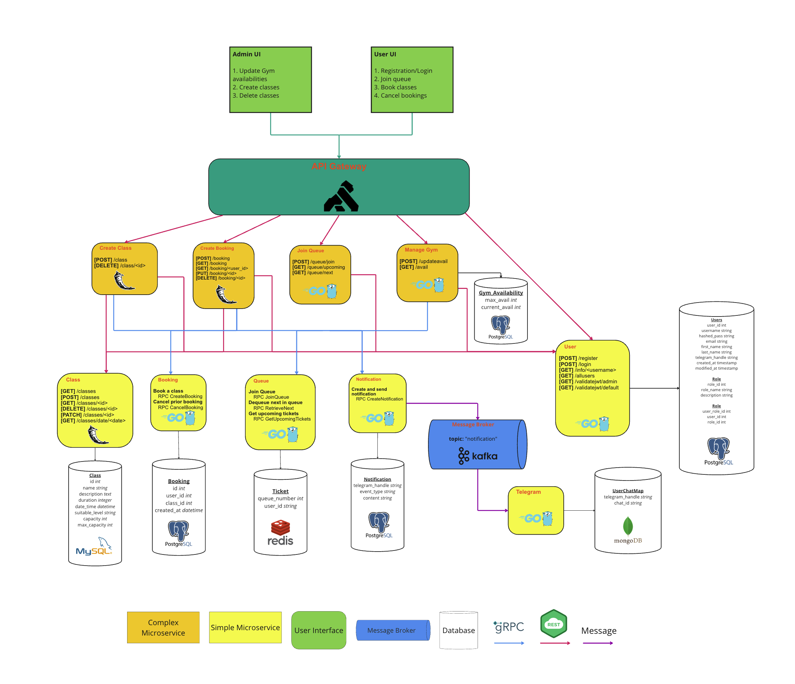
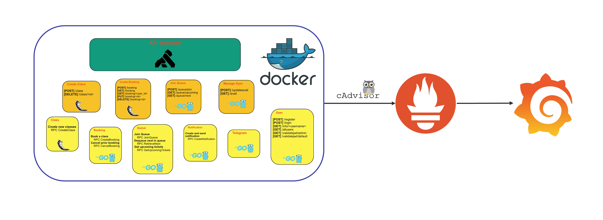
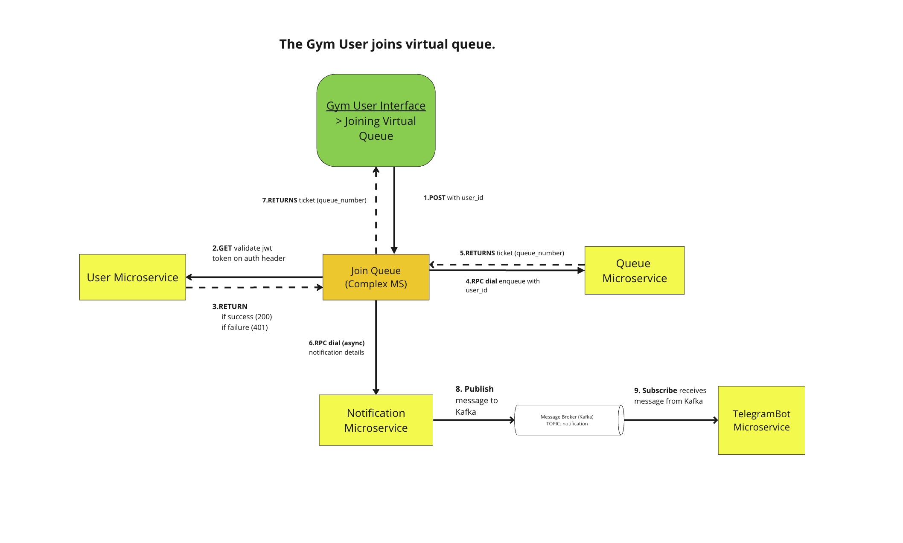
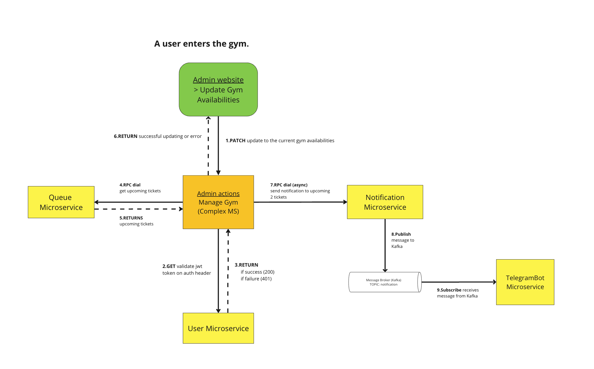

# GYM DADDY Application
Recently, working out has been gaining traction which resulted in long queues forming outside gyms, especially during peak hours. Many gym-goers have expressed their dissatisfaction and frustration with long waiting times due to manual check-in processes and insufficient gym equipment.

To streamline the process, GYM DADDY offers a virtual queuing system to tackle the long queue and the class booking system to digitalise the manual procedures. 


## Technical Diagrams
### System Architecture


### Docker Architecture and Monitoring



## Setting up GYM-DADDY with Docker
### Starting the backend
```bash
# to run docker compose
./build_compose.sh 

```

### Starting the frontend
```bash
# enter frontend repo
cd gd-frontend

# install node dependencies
npm install

# start vue frontend server
npm run serve

```

### Extra
```bash
# to close microservices
docker compose down

# for updating of proto submodules for all microservices
git submodule update --remote
```

## To view the API Documentation
- Use `swagger-api-doc.yml` and copy paste the whole thing inside the Swagger UI Editor `https://editor.swagger.io/`


## ⚠️ Important ⚠️

_To receive notification on Telegram, user must be subscribed to the telegram bot with the same telegram handle used during registration._


## User Scenerios
### User booking a class

1. The user will send a POST request to book the class of their preference. 
2. Before allowing the booking to take place, the user validates their Auth Token with the User Microservice before making any requests, this is to check if the user is authorised. 
3. Once validated, the Create Booking Complex Microservice updates capacity levels to Class Microservice via HTTP PATCH
4. Class Microservice returns 201 if success and error_code if failure to Class Booking Complex Microservice
5. Class Booking Complex Microservice books a specific class via HTTP POST to Booking Microservice
6. Booking Microservice initiates an asynchronous RPC dial to Notification Microservice for booking confirmation message
7. Notification Microservice publishes message to Kafka
8. The TelegramBot Microservice, subscribed to Kafka, receives the message, ensuring that users are informed about the confirmation of their booking


### User joining the gym queue

1. The user interacts with the Gym User Interface which submits a POST request with their user_id to the Join Queue Complex Microservice
2. Before allowing the user to join the queue, the user validates their Auth Token with the User Microservice before making any requests, this is to check if the user is authorised. 
3. Once validated, that the user is added to the queue, the Join Queue Complex Microservice sends the user_id to the Queue Microservice via RPC dial
4. The Queue Microservice assigns the user a queue_number after processing the user_id, and returns a ticket to the Join Queue Complex Microservice
5. The Join Queue Complex Microservice then returns the ticket with the queue_number back to the user
6. The Join Queue Complex Microservice initiates an asynchronous RPC dial to send notification to the Notification Microservice, to inform the upcoming 2 users of their turn. 
7. The Notification Microservice, upon receiving the notification details, publishes a message to Kafka
8. The TelegramBot Microservice, subscribed to Kafka, receives the message and notifies the user through Telegram about their queue_number, keeping them informed about their position in the virtual queue.


### User enters the gym

1. A PATCH request is initiated by the admin through manual updates, when the user enters the gym.
2. Before letting the admin update the gym availability, the admin validates their Auth Token with the User Microservice before making any requests, this is to check if the admin is authorised. 
3. Once validated, the Gym Availability Complex Microservice updates its own availability count to reduce by 1.
4. The Update Gym Availability Complex Microservice then initiates an RPC dial to the Queue Microservice to get the upcoming tickets.
5. The Manage Gym Availability Complex Microservice sends notifications to the next few tickets in the queue asnchronously via RPC dial
6. The Notification Microservice publishes a message to Kafka
7. The TelegramBot Microservice, subscribed to Kafka, receives the message and notifies users about the updated gym availabilities and their ticket status


